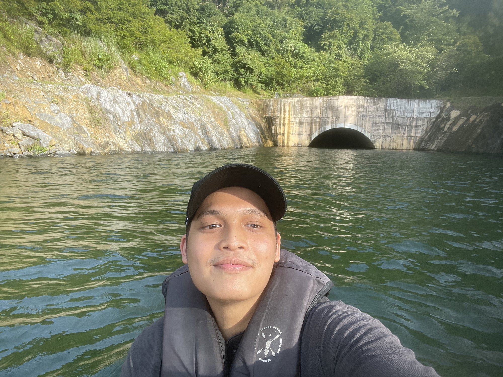

# Adam Roslan — Portfolio

Personal portfolio site. FPV pilot, IoT builder, and the competition archive to go with it.

One HTML file, no framework, no build step, no dependencies. The hero is a real time
WebGL render written by hand, so the whole site is still a single static page you can
drop on any host.

**Live:** [adamroslan.site]



---

## What is in it

| Section | What it does |
| --- | --- |
| **Hero** | Live WebGL portrait. The photo is cut into thousands of textured shards that fly in and assemble on load, tear apart around your cursor, and settle back to a pixel sharp photograph. |
| **Archive** | Seven competition awards, 2024 to 2026, with count up stat pills and working year filters. |
| **Selected projects** | Three builds with tech tags, GitHub links, and a built in slide viewer for the project decks. |
| **Stack** | Tools and languages as a monochrome logo wall. |
| **Story** | Four year timeline, one card per year, built from real photos. |
| **Gallery** | One continuous photo strip that slides from 2026 back to 2023. The big year number rolls over as you cross each boundary. Short clips play muted inline. |
| **Contact** | Email, GitHub, LinkedIn, Instagram. |

### Interaction

- **Intro** counts 000 to 100, then lifts away and triggers the hero assembly.
- **Page transitions** drop a black curtain carrying the section name, jump, then slide it away.
- **Photos** are black and white at rest and go to colour on hover. On touch devices a small dot marks each photo and a tap toggles it.
- **Slide viewer** takes arrow keys, swipe, tap on either half, thumbnails, and Escape.
- **Reduced motion** is respected everywhere. The hero falls back to the plain photo, and so does any browser without WebGL.

---

## Stack

- HTML, CSS, vanilla JavaScript
- WebGL 1.0, hand written vertex and fragment shaders, no Three.js or any other library
- Inter Tight from Google Fonts, with a system font fallback stack
- Deployed as a static site on Vercel

Everything except the font is self hosted, so the page works offline once the assets
are cached.

---

## Structure

```
.
├── index.html          the entire page, CSS and JS inline (80 KB)
├── vercel.json         long cache on /assets, no cache on the HTML
├── README.md
└── assets/
    ├── hero.jpg                    2000 px hero source for the WebGL texture
    ├── cover_lock.jpg              project covers
    ├── cover_serra.jpg
    ├── cover_undertone.jpg
    ├── 2023_*.jpg … 2026_*.jpg     52 gallery photos, grouped by year in the filename
    ├── *.mp4                       3 gallery clips
    ├── Smart_Door_Lock.pdf         project decks, linked from the project cards
    ├── Smart_Serra.pdf
    └── deck/
        ├── lock-01.jpg … lock-15.jpg      deck pages for the slide viewer
        └── serra-01.jpg … serra-14.jpg
```

The gallery and the slide viewer read from arrays near the bottom of `index.html`
(`GAL` and `DECKS`). Filenames are the source of truth for which year a photo belongs to.

---

## Run it locally

WebGL needs to read the hero photo as a texture, and browsers block that for pages
opened straight off the disk. Serve the folder over HTTP instead:

```bash
python3 -m http.server 8000
# then open http://localhost:8000
```

Any static server works. Opening `index.html` by double clicking it still renders the
whole site, the hero just shows the plain photo instead of the live render.

---

## Deploy

### Vercel, drag and drop

Zip this folder and drop the zip on [vercel.com/new](https://vercel.com/new). No build
settings needed.

### Vercel from GitHub, redeploys on every push

```bash
git init
git add .
git commit -m "portfolio"
git branch -M main
git remote add origin https://github.com/dammnnnnnnnn/portfolio.git
git push -u origin main
```

Then on Vercel choose **Add New → Project**, import the repo and deploy.
Framework preset **Other**, build command empty, output directory empty.

Custom domain goes under **Project → Settings → Domains**.

---

## Editing

**Swap a photo.** Replace the file in `assets/` and keep the filename. Nothing in the
HTML needs to change.

**Add a gallery photo.** Drop it in `assets/` named `<year>_<anything>.jpg`, then add one
entry to the matching year array in `GAL` inside `index.html`:

```js
{"t":"img","src":"assets/2026_myphoto.jpg","ar":1.333}
```

`ar` is width divided by height. Above 1.2 renders wide, below 0.85 renders tall,
anything between renders square. Use `"t":"vid"` with an `.mp4` for a clip.

**Add an award.** Copy one `.row` block in the Archive section and set `data-y` to the
year. Add `win` to the pill class for golds and first places.

**Change the hero photo.** Replace `assets/hero.jpg`. Use something around 2000 px on the
long edge, since the shard mesh samples it directly and a soft source shows.

**Tune the hero render.** In the particle block near the bottom of `index.html`:

```js
const cell = small ? 9 : 7;   // shard size in CSS pixels, smaller means finer
```

Assembly speed is `prog + dt/1700` in the same block. The cursor radius and push
strength are `smoothstep(0.21, 0.0, dist)` and `* 0.085` in the vertex shader.

---

## Browser support

Chrome, Edge, Safari and Firefox, current versions, desktop and mobile. The live hero
needs WebGL 1.0; without it the page shows the photo and everything else behaves
normally.

---

## Credits

Photography and project work are mine. Stack logos come from
[Simple Icons](https://simpleicons.org) and remain trademarks of their respective
owners. Type is [Inter Tight](https://fonts.google.com/specimen/Inter+Tight).

## Contact

- Email: AdamRoslan141@gmail.com
- GitHub: [@dammnnnnnnnn](https://github.com/dammnnnnnnnn)
- LinkedIn: [adamroslan141](https://www.linkedin.com/in/adamroslan141)
- Instagram: [@___.daammm](https://www.instagram.com/___.daammm)

## License

Code is free to read and learn from. The photographs, the competition record and the
project decks are not licensed for reuse.
